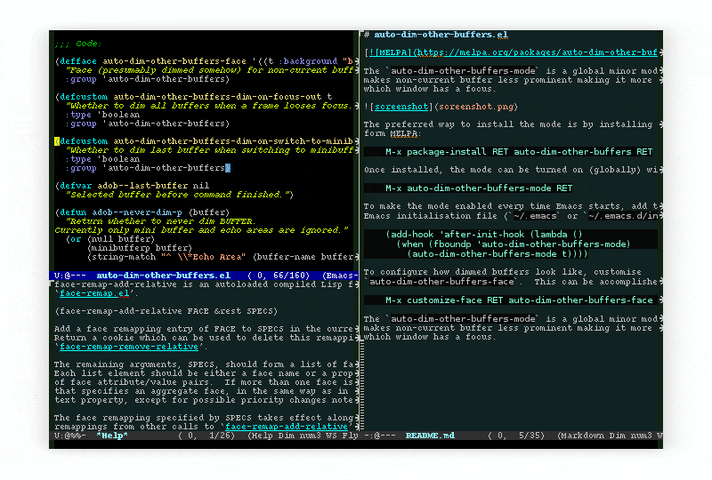

# auto-dim-other-buffers.el

The `auto-dim-other-buffers-mode` is a global minor mode which makes
windows without focus less prominent.  With many windows in a frame,
this mode helps recognise which is the selected window by providing
a non-intrusive but still noticeable visual indicator.

The mode provides two indications of the selected window.  Firstly,
background of non-selected windows is dimmed.  Secondly, fringes of
the selected windows are highlighted (not visualised in the image
above).

## Installation

The preferred way to install the mode is by grabbing
`auto-dim-other-buffers` package form NonGNU ELPA:

    M-x package-install RET auto-dim-other-buffers RET

Once installed, enable the mode with:

    M-x auto-dim-other-buffers-mode RET

To make it enabled every time Emacs starts, add the following to Emacs
initialisation file (typically `~/.emacs`, `~/.emacs.d/init.el` or
`~/.config/emacs/init.el`):

    (add-hook 'after-init-hook (lambda ()
      (when (fboundp 'auto-dim-other-buffers-mode)
        (auto-dim-other-buffers-mode t))))

## Customisation

To configure how dimmed buffers look, customise
`auto-dim-other-buffers`.  This can be accomplished by:

    M-x customize-face RET auto-dim-other-buffers RET

More options can be found in `auto-dim-other-buffers` customisation
group which can be accessed with:

    M-x customize-group RET auto-dim-other-buffers RET

Highlighting of fringes can be done by removing `fringe` entry from
`auto-dim-other-buffers-affected-faces` list.  Either via customising
the variable or using the following snippet:

    (setq auto-dim-other-buffers-affected-faces
          (assq-delete-all 'fringe auto-dim-other-buffers-affected-faces))

## Troubleshooting

### My screen is flickering

By its nature, `auto-dim-other-buffers-mode` often forces full-window
refreshes which may cause flickering on some systems and displays.  To
mitigate it, try disabling `fringe` highlighting which—due to Emacs’
display code limitation—require full-frame refresh.  See Customisation
section above for instruction how to do it.

### Text which should be hidden in org-mode is not

To hide text, `org-mode` uses `org-hide` face whose foreground is set
to the background colour of the `default` face.  When
`auto-dim-other-buffers-mode` changes background of a dimmed window it
also needs to be applied to the `org-hide` face.  The good news is
that this is supported out of the box.  The caveat is that it requires
that `auto-dim-other-buffers` and `auto-dim-other-buffers-hide` are
changed in sync.

If text which should be hidden in org-mode is visible faintly, the
most likely reason is that the latter face has not been updated.  The
solution is to customise it via

    M-x customize-face RET auto-dim-other-buffers-hide RET

and set its foreground and background to match background of the
`auto-dim-other-buffers`.

## Afterword

Note that despite it, the mode operates on *windows* rather than
buffers.  In other words, selected window is highlighted and all other
windows are dimmed even if they display the same buffer.  The package
is named `auto-dim-other-buffer` for historical reasons.

Requires Emacs 27 to work.
