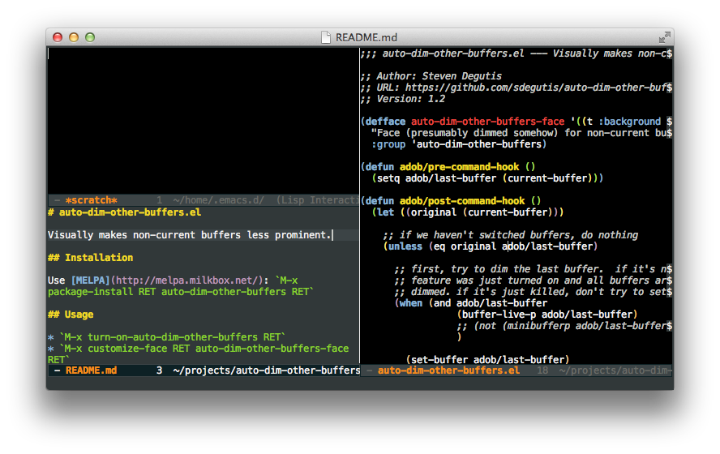

# auto-dim-other-buffers.el

The `auto-dim-other-buffers-mode` is a global minor mode which
makes non-current buffer less prominent making it more apparent
which window has a focus.

The preferred way to install the mode is by installing a package
form MELPA:

    M-x package-install RET auto-dim-other-buffers RET

Once installed, the mode can be turned on (globally) with:

    M-x auto-dim-other-buffers-mode RET

To make the mode enabled every time Emacs starts, add the following to
Emacs initialisation file (`~/.emacs` or `~/.emacs.d/init.el`):

    (add-hook 'after-init-hook (lambda ()
      (when (fboundp 'auto-dim-other-buffers-mode)
        (auto-dim-other-buffers-mode t))))

To configure how dimmed buffers look like, customise
`auto-dim-other-buffers-face`.  This can be accomplished by:

    M-x customize-face RET auto-dim-other-buffers-face RET

The `auto-dim-other-buffers-mode` is a global minor mode which
makes non-current buffer less prominent making it more apparent
which window has a focus.
